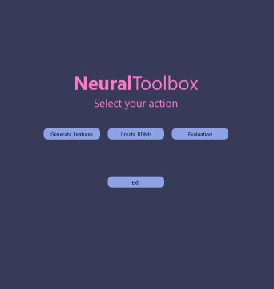
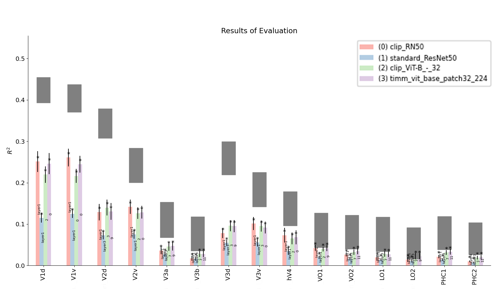

>This is the toolbox from the paper ["Net2Brain: A Toolbox to compare artificial vision models with human brain responses"](https://arxiv.org/abs/2208.09677) which has been presented at CCNeuro 2022.

# Net2Brain



**Net2Brain** is an easy-to-use framework that allows neuroscientists to
compare human brain activity patterns in response to stimuli with the
activation patterns of over 600 Deep Neural Networks (DNNs) processing the same
stimuli.

Any dataset composed of either image or video files can be fed into the program
and passed through a collection of DNNs performing different visual tasks. 
The toolbox allows the user to compare the representations generated by the
DNNs with those recorded in the brain using Representational Similarity
Analysis (RSA) ([Kriegeskorte et al., 2008](https://www.ncbi.nlm.nih.gov/pmc/articles/PMC2605405/)), weighted RSA and through Searchlight-Analysis.

The program can be executed via CLI-Commands, a CLI-GUI, or via an intuitively designed GUI that simplifies the control of the functions. Alternatively, all functionalities can be conveniently used over Google Colab which simplifies all the necessary installs.


# Installation

To install Net2Brain, follow these steps (or use our [Colab-Environment](#google-colab-playground) for faster usage):

1. Clone this github repository in your local machine.
You can use the following command in your terminal:
    ```bash
    git clone https://github.com/ToastyDom/Net2Brain.git
    ```
2. Step into the directory of your local copy of Net2Brain:
    ```bash
    cd {your_path_to_net2brain}
    ```
3. In case you wish to create a virtual environment (Windows):
    ```bash
    pip install virtualenv
    virtualenv --python . venv
    .\venv\Scripts\activate
    ```
4. Install Net2Brain by running:
    ```bash
    pip install .
    ```

> __NOTE__: we recommend that you use [conda enviroments](https://docs.conda.io/en/latest/)
 when installing Net2Brain.


## Installing CLIP, VISSL and Detectron2
Installing CLIP, VISSL and Detectron2 can present issues on non-Linux systems. We recommend using the Google Colab Version of the Toolbox to avoid having to manage the installs. Click here for installation help for [CLIP](https://github.com/openai/CLIP), [VISSL](https://github.com/facebookresearch/vissl) and [Detectron2](https://github.com/facebookresearch/detectron2).

## Google Colab Playground
You can run net2brain in Google Colab for a quick demo, with the following steps:
1. Download the ipython notebook named [demo/net2brain.ipynb](./demo/net2brain.ipynb).
2. Open this file in [Google Colab](https://colab.research.google.com/).
3. Read and execute the cells within the notebook.


# Usage

You can use Net2Brain in your command line terminal by running:

```bash
python net2brain/toolbox_ui.py
```

Or you can start the GUI by running:

```bash
python net2brain/toolbox_gui.py
```

You can also use CLI Commands to call the functions like:
```bash
python net2brain/toolbox_cli.py --commands
```
A list of all commands can be found [here](#cli-commands).

You can then choose to execute one of the following options:

## Generate Features
Choose a dataset composed of either .jpg or .mp4 files and select one of many different DNNs to generate feature representations (i.e. activations) of the stimuli. These will be saved in the "feats" folder which will later be accessed by the RDM-creation functionality of the toolbox.

## Create RDMs
Use the extracted features (activations) to generate a representational dissimilarity matrix (RDM) per network layer. These will be saved in the "rdm" folder which will later be accessed by the evaluation functions of the toolbox.

## Evaluation
Our toolbox offers 3 different metrics for evaluating DNN RDMs and ROI RDMs. One is RSA, but also Weighted RSA and Searchlight Analysis. Select the evaluation metric along with DNNs from a certain dataset along with its brain ROIs for comparison. The function will return a list of results along with a plot that will be saved in the "eval" folder.




# CLI Commands
> __NOTE__: A list of all available networks for the CLI can be found [here](net2brain/architectures/Networks.md).

If you don't want to work with the UI or the GUI, we offer to control the functionality via a CLI. The following options can be selected:

- --layers: "show"
- --task: "gen_feats", "create_rdm", "eval"
- --datset: "78images", "92images" or any other added dataset
- --dnn: "standard-AlexNet", "standard-ResNet18" and many more
- --eval: "rsa", "wrsa", "searchlight"
- --roi: "fmri_EVC_RDMs.npz", "fmri_IT_RDMs.npz" and any ohter added ROI of the chosen dataset.

## Examples:

Generating features for AlexNet on the 78images dataset:

```bash
python toolbox_cli.py --task gen_feats --dataset 78images --dnn standard-AlexNet
```

Generating features for AlexNet and ResNet18 on the 78images dataset:

```bash
python toolbox_cli.py --task gen_feats --dataset 78images --dnn standard-AlexNet --dnn standard-ResNet18
```

Generating RDMs to the features of AlexNet and ResNet18 from the previous command:

```bash
python toolbox_cli.py --task create_rdm --dataset 78images --dnn standard-AlexNet --dnn standard-ResNet18
```


Perform RSA on the previously generated RDMs on two ROIs.

```bash
python toolbox_cli.py --task eval --dataset 78images --dnn standard-AlexNet --dnn standard-ResNet18 --eval rsa --roi fmri_EVC_RDMs.npz --roi fmri_IT_RDMs.npz
``` 

Displaying all layers of AlexNet that could potentially be extracted (if added to file - see [here](#how-to-change-layers-for-extraction))
```bash
python toolbox_cli.py --layers show --dnn standard-AlexNet
```


# Evaluations

## RSA
Although DNNs find their origin in the modeling of neurons, the systems are architecturally very different from the brain regions. Thus, a comparison of the individual model units and the neurons becomes a challenging task. Therefore, instead of comparing each neuron to each model unit, the toolbox employs Representational Similarity Analysis (RSA) ([Kriegeskorte et al., 2008](https://www.ncbi.nlm.nih.gov/pmc/articles/PMC2605405/)) as a metric to evaluate brain and network data. RSA abstracts from activity patterns to RDMs which allows to compare two completely different systems.

The procedure is to take an activity pattern that resulted from one participant looking at a certain image and compare it to all the other patterns that resulted from the same participant looking at the other images. Comparisons are made by using the correlation distance that calculates the dissimilarity between the activations from two images *i* and *j* by subtracting 1 from the Pearson Correlation Coefficient.

The correlation distance evaluates how different the brain interprets one image compared to every other image. These dissimilarities are collected in an Representatil Dissimilarity Matrix (RDM), a matrix, in which the width and height correspond to the number of stimuli (here images).

Similar to the brain activities, the activations of a DNN can also be abstracted into an RDM.

For the final RSA, brain RDM and model RDM are again compared using the correlation value between both. The resulting value is a measure for how different a model layer and a brain region interpret a given dataset. The evaluation follows the idea that if the brain interprets two images as different, the network should do the same.

## Weighted RSA
When asserting brain ROIs using DNNs, there are several features as part of the dissimilarities we want to measure. They can be in the form of different layers and in the form of brain recordings from different participants. In normal RSA, each feature contributes equally to the overall correlation. However, these features all have different relative weights. When their relative weights are unknown, weighted RSA can be used ([Junhai Xu et al., 2021 ](https://www.sciencedirect.com/science/article/abs/pii/S0306452221002876)).

In weighted RSA, an RDM is predicted as the weighted sum of the given RDMs. The weights are given as a theta value that weights each of the given RDMs to predict a new RDM. In the toolbox, this is implemented in two ways. With the common weighted RSA, a fitting model is fed with layer RDMs and then fitted with the brain data from an ROI to find a theta, that approximates that data RDMs as well as possible. Using this theta, a new RDM is predicted and used to calculate the correlation between itself and the RDMs of the current ROI. These correlation values between all participants of this ROI and the predicted RDM are averaged and returned as a result ([Kriegeskorte et al., 2008](https://www.ncbi.nlm.nih.gov/pmc/articles/PMC2605405/)).


## Searchlight
Searchlight, also called "information mapping," is a method of multivariate pattern analysis used for fMRI data. This measure is an alternative to whole-brain or ROI-based analyses because it examines the whole brain in terms of voxel clusters. In this method, maps are created by computing correlations in spherical subsets (serachlights) centered on each voxel. To interpret the results, either a Support Vector Machine (SVM) is used to partition the data vectors into two classes of trials or rank correlation is applied.([Etzel et al., 2013](https://doi.org/10.1016/j.neuroimage.2013.03.041), [Allefeld et al., 2014](https://doi.org/10.1016/j.neuroimage.2013.11.043))

The drawback of ROI-based analysis is that it examines whether the collective voxels contain information about different states, but not whether specific subregions of those ROIs also carry the majority of the classification. With Searchlight, by scanning the whole brain, there is the possibility of finding regions in the brain that distinguish between states. However, this also means that Searchlight analysis is computationally intensive without data parallelization ([Manoj et al., 2020](https://brainiak.org/tutorials/07-searchlight/)).\\

The toolbox expects a numpy array in the form [ROI, subject, stimuli, stimuli] to perform the searchlight analysis. First, the rank of the model RDMs and, for each subject, the rank of the searchlight RDMs is calculated. Finally, to perform multimodal RSA, the ranks are used to compute the Pearson correlation. To present the results, the correlation values for each layer are averaged along all ROIs within the searchlight.


# How to analyze your own dataset

Net2Brain includes 78 images from the LaMem dataset, which allows the user to 
quickly test the functionality of the toolbox, and intuitively demonstrates 
where new data can be added for analysis.

## Add new stimuli datasets
1. Go to `./input_data/**stimuli_data**`.
2. Create a folder with a name of your choice (e.g. `my_stimuli`).
3. Populate the folder with `.jpg` or `.mp4` representing the stimuli dataset.

## Add new brain RDMs
1. Go to `./input_data/**brain_data**`.
2. Create a folder with a name of your choice, **which must be the same as the 
stimuli set.**
3. Populate the folder with `.npz` files representing the brain's RDMs.

 __Shape of fMRI RDMs__: For **fMRI** RDMs, the data has to be a Numpy array in the shape of *(p, n, n)*, where *p* denotes the number of participants and *n* the number of stimuli. In other words, it has to be an array with *p* RDMs in the shape of *n* x *n*. 

__Shape of MEG RDMs__:For **MEG** RDMs, the array must be in the form of *(p, t, n, n)*, where *t* is the dimension of the timestamp since with MEG there are usually multiple scans per subject at different times.

__Shape of Searchlight RDMs__: For **Searchlight** RDMs, the data must be in form of [r, p, n, n], where *r* is the dimension of the ROI.

> __NOTE__: The brain ROIs for RSA and WRSA have to have either MEG or FMRI within its name and the
data has to come in form of an RDM or a list of RDMs


# How to change layers for extraction
Each netset has its own file within [./architectures](net2brain/architectures/). They are composed of three parts:
1. _MODELS_: A dictionary of the model to load
2. _MODEL_NODES_: A dictionary of the layers to extract
3. Preprocessing for these models.

By changing the entries in _MODEL_NODES_, the layers that are to be extracted can be adapted.
To find out which layers are available for extraction run the following command:


```bash
python toolbox_cli.py --layers show --dnn <DNN of your choice>
```
For example:
```bash
python toolbox_cli.py --layers show --dnn standard-AlexNet
```


# How to report a bug or suggest a feature

We welcome new contributions to Net2Brain.
If you find a bug or have ideas for a new feature, feel free to write an issue
or submit pull requests yourself.

 

# Contributors of Net2Brain
```bash
Domenic Bersch, Kshitij Dwivedi, Martina Vilas, Radoslaw M. Cichy, Gemma Roig
```


# Citing Net2Brain
If you use Net2Brain in your research, please don't forget to cite us:
```bash
@misc{https://doi.org/10.48550/arxiv.2208.09677,
     doi = {10.48550/ARXIV.2208.09677},
     url = {https://arxiv.org/abs/2208.09677},
     author = {Bersch, Domenic and Dwivedi, Kshitij and Vilas, 
     Martina and Cichy, Radoslaw M. and Roig, Gemma},
     title = {Net2Brain: A Toolbox to compare artificial vision models 
     with human brain responses},
     publisher = {arXiv},
     year = {2022},
     copyright = {Creative Commons Attribution Non Commercial Share Alike 4.0 International}}
```


# References
This toolbox is inspired by the Algonauts Project and contains collections of artificial neural networks from different sources.

- **The Algonauts Project:** Radoslaw Martin Cichy, Gemma Roig, Alex Andonian, Kshitij Dwivedi, Benjamin Lahner, Alex Lascelles, Yalda Mohsenzadeh, Kandan Ramakrishnan, and Aude Oliva. (2019). The Algonauts Project: A Platform for Communication between the Sciences of Biological and Artificial Intelligence. arXiv, arXiv:1905.05675
- **The dataset provided in the library:** Radoslaw M. Cichy, Dimitrios Pantazis and Aude Oliva. (2016). Similarity-Based Fusion of MEG and fMRI Reveals Spatio-Temporal Dynamics in Human Cortex During Visual Object Recognition. Cerebral Cortex, 26 (8): 3563-3579.
- **RSA-Toolbox:** Nikolaus Kriegeskorte, Jörn Diedrichsen, Marieke Mur and Ian Charest (2019) The toolbox replaces the 2013 matlab version the toolbox of rsatoolbox previously at ilogue/rsatoolbox and reflects many of the new methodological developements. Net2Brain uses its functionality to perform "Weighted RSA".
- **PyTorch Models:** https://pytorch.org/vision/0.8/models.html
- **CORnet-Z and CORnet-RT:** Kubilius, J., Schrimpf, M., Nayebi, A., Bear, D., Yamins, D.L.K., DiCarlo, J.J. (2018) CORnet: Modeling the Neural Mechanisms of Core Object Recognition. biorxiv. doi:10.1101/408385
- **CORnet-S:** Kubilius, J., Schrimpf, M., Kar, K., Rajalingham, R., Hong, H., Majaj, N., ... & Dicarlo, J. (2019). Brain-like object recognition with high-performing shallow recurrent ANNs. In Advances in Neural Information Processing Systems (pp. 12785-12796).
- **MoCo:** Kaiming He and Haoqi Fan and Yuxin Wu and Saining Xie and Ross Girshick, Momentum Contrast for Unsupervised Visual Representation Learning (2019), arXiv preprint arXiv:1911.05722
- **SwAv:** Caron, Mathilde and Misra, Ishan and Mairal, Julien and Goyal, Priya and Bojanowski, Piotr and Joulin, Armand ,Unsupervised Learning of Visual Features by Contrasting Cluster Assignments (2020), Proceedings of Advances in Neural Information Processing Systems (NeurIPS)
- **Taskonomy:** Zamir, Amir R and Sax, Alexander and and Shen, William B and Guibas, Leonidas and Malik, Jitendra and Savarese, Silvio, Taskonomy: Disentangling Task Transfer Learning (2018), 2018 IEEE Conference on Computer Vision and Pattern Recognition (CVPR)
- **Image Models:** Ross Wightman, PyTorch Image Models(2019), 10.5281/zenodo.4414861, https://github.com/rwightman/pytorch-image-models
- **Detectron2:** Yuxin Wu and Alexander Kirillov and Francisco Massa and Wan-Yen Lo and Ross Girshick, Detectron2 (2019), https://github.com/facebookresearch/detectron2
- **SlowFast:** Haoqi Fan and Yanghao Li and Bo Xiong and Wan-Yen Lo and Christoph Feichtenhofer, PySlowFast(2020), https://github.com/facebookresearch/slowfast
